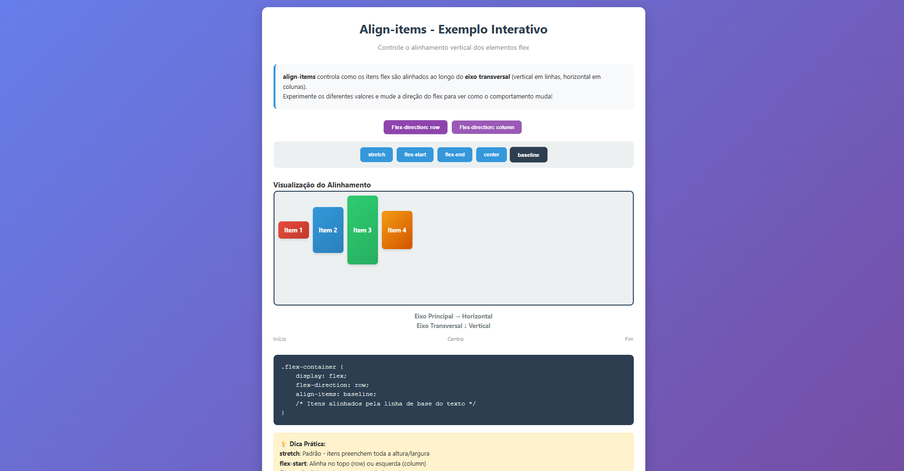

# ↕️ Align-Items

Este repositório é um guia prático para dominar a propriedade **`align-items`** do CSS Flexbox. Use-o para visualizar como o alinhamento dos itens muda, especialmente quando você inverte a direção do Flex.

---

## 📐 O que é `align-items`?

A propriedade `align-items` é o oposto de `justify-content` em termos de eixo:

* **Função:** Controla o alinhamento vertical dos itens flexíveis ao longo do **Eixo Transversal (Cross Axis)** do Container Flex.
* **Eixo Transversal (ou Cruzado):** É o eixo perpendicular ao Eixo Principal.
    * Se `flex-direction: row` (horizontal), o Eixo Transversal é **Vertical**.
    * Se `flex-direction: column` (vertical), o Eixo Transversal é **Horizontal**.

---

## ✨ Valores de `align-items` e Suas Funções

No Playground, você pode experimentar os valores abaixo e observar o impacto nas caixas coloridas (`Item 1` a `Item 4`):

| Valor | Função | Dica Prática |
| :--- | :--- | :--- |
| **`stretch` (Padrão)** | Os itens esticam para preencher toda a altura/largura disponível no Eixo Transversal (a menos que tenham uma altura definida). | **Preenche tudo.** |
| **`flex-start`** | Alinha os itens no **início** do Eixo Transversal (topo, por padrão). | **Alinha no topo (ou esquerda/direita em `column`).** |
| **`flex-end`** | Alinha os itens no **final** do Eixo Transversal (base, por padrão). | **Alinha na base (ou esquerda/direita em `column`).** |
| **`center`** | Os itens são **centralizados** no meio do Eixo Transversal. | **Centraliza Verticalmente (ou horizontalmente em `column`).** |
| **`baseline`** | Alinha os itens com base na **linha de base do texto** contido neles, e não na borda da caixa. | **Alinha o texto.** |

---

## 🔄 Flex-Direction: A Chave de Leitura

A seção interativa permite que você altere a direção principal do Flex para entender como o **Eixo Transversal** se comporta:

1.  **`flex-direction: row` (Padrão):** O Eixo Principal é Horizontal. **`align-items` controla o alinhamento Vertical.**
2.  **`flex-direction: column`:** O Eixo Principal é Vertical. **`align-items` controla o alinhamento Horizontal.**

Experimente mudar a direção e, em seguida, clique nos botões de alinhamento (`center`, `flex-start`, etc.) para fixar o conceito de eixos cruzados.

